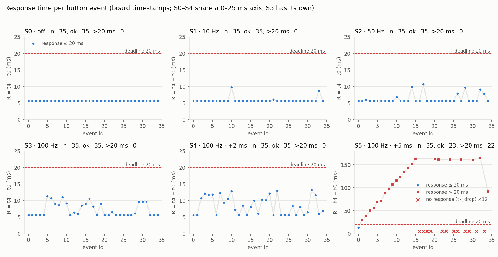
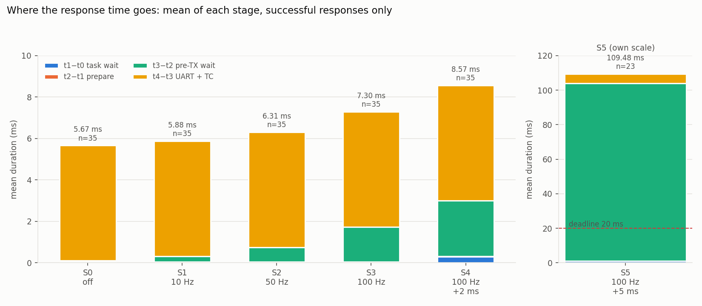
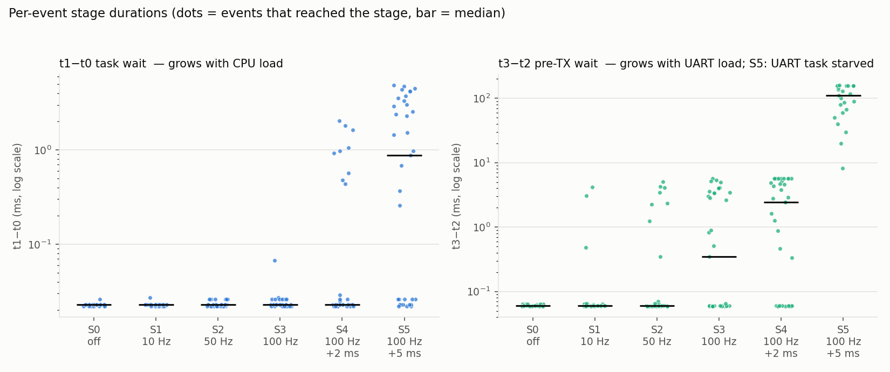
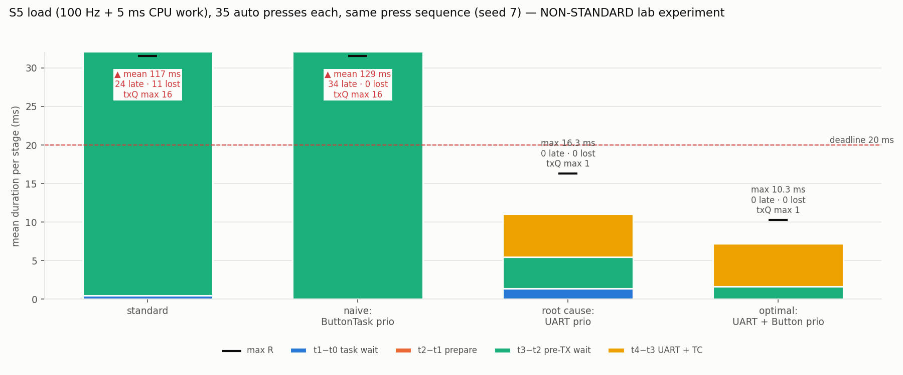

# Analiz Raporu: Ödev 01, Yük Altında Buton Yanıtı

> Tüm sayılar NUCLEO-L476RG kartında alınmış gerçek ölçümlerdir: `measurements/S0.csv … S5.csv`.
> Tablo ve grafikler `analysis/analyze.py` ile yalnızca bu ham veriden üretildi, elle düzeltme yapılmadı.
> Ham veri, analizden önce ayrı bir commit'te sabitlendi (`ce29645`).

## 1. Gereksinim

| | |
|---|---|
| **Olay** | B1 butonuna basış. Filtreden geçen düşen kenar, EXTI ISR girişinde **t₀** |
| **Sonuç** | "Butona basıldı" yanıtının (`BTN,<id>,<Sx>,PRESSED`, 64 bayt) son bitinin UART'tan çıkması: TC kesmesi işlenirken **t₄** |
| **Ölçü** | **R = t₄ − t₀**, kart saatiyle (TIM2, 1 MHz). PC saati kullanılmıyor |
| **Deadline** | R ≤ 20 ms (ödev için seçilmiş eşik, ürün standardı değil) |
| **Kayıp** | Yanıtı hiç gelmeyen olay "deadline karşılandı" sayılmaz, ayrıca raporlanır |

Aşamalar (spec §6.3):

| Aralık | Anlamı |
|---|---|
| t₁ − t₀ | ISR'dan ButtonTask'ın olayı almasına kadar geçen süre. Yüksek öncelikli görevin preemption'ı dahil |
| t₂ − t₁ | Yanıtı hazırlama (duvar saati) |
| t₃ − t₂ | TX öncesi bekleme: kuyruğa verme + FIFO'da bekleme + UartTxTask'ın CPU alması. **Saf FIFO beklemesi değil** |
| t₄ − t₃ | UART başlatma, hat aktarımı (64 B × 10 bit / 115200 = 5,556 ms) ve TC gözlemi |

## 2. Deney koşulları

| Ayar | Değer |
|---|---|
| MCU / saat | STM32L476RG, 80 MHz (HSI16 → PLL) |
| RTOS | FreeRTOS V10.3.1 (CubeMX paketi), preemptive, tick 1 kHz |
| Görevler | TelemetryTask **3** > ButtonTask **2** > UartTxTask **1** (+ Idle 0, Tmr Svc 2 uykuda) |
| Kuyruklar | buttonQ 8 olay, txQ 16 mesaj, FIFO, değer kopyalama |
| UART | USART2 115200 8N1, **IT** gönderim, görev TC'ye kadar bloklu (ADR-001), timeout 1 s |
| Mesaj | Her TEL/BTN tam 64 bayt (63 + LF) |
| Zaman kaynağı | TIM2 32-bit, 1 MHz (ADR-002) |
| Filtre | Son kabul edilen kenardan sonraki 30 ms içindeki tekrar kenarları atılıyor |
| Derleme | Debug, `-O0`. CPU işi aynı derlemeyle kalibre edildi |
| Akış | 5 s ısınma → 35 kabul edilen basış → telemetri durur → TX boşaltılır → export (ADR-003) |
| Basışlar | Elle, düzensiz aralıklarla. Ölçülen aralık 0,54–2,18 s |

Ölçülen yük parametreleri:

| | S1 | S2 | S3 | S4 | S5 |
|---|---|---|---|---|---|
| Gözlenen telemetri hızı | 10,00 Hz | 50,00 Hz | 100,01 Hz | 100,01 Hz | 100,01 Hz |
| Periyot min–max (µs) | 99 993–100 002 | 19 993–20 004 | 9 993–10 008 | 9 993–10 004 | 9 995–10 003 |
| Ek CPU işi, ort / max (µs) | – | – | – | 2 012 / 2 072 | 5 050 / 5 066 |
| TEL hat doluluğu (hesap) | %5,6 | %27,8 | %55,6 | %55,6 | %55,6 |
| Ek CPU talebi (hesap) | – | – | – | ≈%20 | ≈%50 |

Kalibrasyon: 10 000 iterasyonun en kısa süresi 3 884 µs. Buna göre S4 için 5 149, S5 için 12 873 iterasyon kullanıldı. Kalibrasyon scheduler başlamadan önce yapıldı, 5 tekrarın en kısası alındı; bu yöntem kesme etkisini dışarıda bırakıyor. Çalışma sırasında ölçülen iş süresi hedefin %0,6 (S4) ve %1,0 (S5) üzerinde. Fark, işin ortasına giren UART TXE ve tick kesmelerinden geliyor: ölçülen süre duvar saati, CPU süresi değil.

## 3. Sonuçlar

Tam tablo: [`measurements/summary.csv`](../measurements/summary.csv).

| Senaryo | Kabul | Yanıt geldi | Kayıp | R min | R ort | R p95 | R max | > 20 ms | txQ max |
|---|---|---|---|---|---|---|---|---|---|
| S0 kapalı | 35 | 35 | 0 | 5,67 | 5,67 | 5,67 | 5,67 | 0 | 1 |
| S1 10 Hz | 35 | 35 | 0 | 5,67 | 5,88 | 6,86 | 9,80 | 0 | 1 |
| S2 50 Hz | 35 | 35 | 0 | 5,67 | 6,31 | 9,72 | 10,72 | 0 | 1 |
| S3 100 Hz | 35 | 35 | 0 | 5,67 | 7,30 | 10,83 | 11,29 | 0 | 2 |
| S4 100 Hz + 2 ms | 35 | 35 | 0 | 5,67 | 8,57 | 12,91 | 13,26 | 0 | 2 |
| S5 100 Hz + 5 ms | 35 | **23** | **12 (tx_drop)** | 13,75 | **109,48** | 163,44 | **164,05** | **22** | **16** |

R değerleri ms cinsinden ve yalnızca yanıtı gelen olaylardan hesaplandı. Tüm senaryolarda bounce_rejected = 0, btn_drop = 0, tx_error = 0, timeout = 0, uart_error = 0, format hatası = 0 ve kayıt taşması = 0. S5'te buna ek olarak **7 TEL mesajı** kuyruğa giremedi.

Aşama ortalamaları, yalnızca yanıtı gelen olaylar (ms):

| | t₁−t₀ | t₂−t₁ | t₃−t₂ | t₄−t₃ |
|---|---|---|---|---|
| S0 | 0,023 | 0,024 | 0,061 | 5,560 |
| S1 | 0,023 | 0,024 | 0,276 | 5,560 |
| S2 | 0,023 | 0,025 | 0,704 | 5,560 |
| S3 | 0,025 | 0,025 | 1,689 | 5,560 |
| S4 | **0,300** | 0,025 | **2,685** | 5,560 |
| S5 | **1,030** | 0,025 | **102,862** | 5,560 |







## 4. Hangi aşama değişti ve neden?

### 4.1 Sabit kalanlar
- **t₄ − t₃ = 5,560 ms, her senaryoda ve her olayda (±1 µs).** Hesaplanan hat süresi 5,556 ms. Aradaki ~4 µs, TC kesmesinin gelmesi ve callback'in çalışması. IT + TC yöntemi (ADR-001) son biti tutarlı biçimde yakalıyor.
- **t₂ − t₁ ≈ 25 µs.** Mesaj hazırlama printf kullanmıyor, süresi sabit. `-O0` derlemede bile önemsiz.

### 4.2 Frekans → TX öncesi bekleme (S0 → S3)
CPU işi yokken yalnızca **t₃ − t₂** değişiyor. Ortalamalar 0,06 → 0,28 → 0,70 → 1,69 ms. t₁ − t₀ ~23 µs'de sabit.

Nedeni: UART tek bir hat ve başlamış bir gönderim yarıda kesilmiyor. BTN yanıtı, hatta o an giden TEL mesajının (≤ 5,56 ms) ve varsa kuyrukta önündeki mesajların bitmesini bekliyor. Telemetri hızı arttıkça bir basışın dolu hatta denk gelme olasılığı da artıyor. Bu olasılık kabaca hat doluluğu kadar: %5,6 / %27,8 / %55,6. Dağılım grafiğinde hattı boş bulan basışlar 0,06 ms'de, dolu bulanlar 0,3–5,6 ms arasında görünüyor.

S3'te t₃ − t₂ en fazla 5,64 ms ve txQ en yüksek 2. Bir basış, gönderilmekte olan TEL'in yanında kuyrukta bekleyen bir TEL'i daha beklemiş. S3'te hat kapasitesinin yaklaşık %44'ü boş olduğu için birikim hemen eriyor.

### 4.3 CPU yükü → görev beklemesi (S3 → S4 → S5)
Telemetri 100 Hz'de sabitken **t₁ − t₀** büyüyor: S3'te en fazla 0,07 ms, S4'te 2,03 ms, S5'te 4,83 ms. En büyük değerler, ölçülen iş süreleriyle (2,07 / 5,07 ms) uyumlu.

Nedeni: Basış, öncelik 3'teki TelemetryTask'ın hesaplama işine denk gelirse, olay kuyruğa hemen girse bile öncelik 2'deki ButtonTask işin bitmesini bekliyor. İş periyodun yaklaşık %20'sini (S4) ve %50'sini (S5) kapladığı için yükselmiş değerler de kabaca bu oranda görülüyor: S4'te 35 basışın 9'u, S5'te 21'i 0,1 ms'yi aştı.

S4'te t₃ − t₂ de arttı (1,69 → 2,69 ms). Bir gönderim bittiğinde (TC) CPU o an hesaplama yapıyorsa, UartTxTask sıradaki mesajı ancak iş bitince başlatabiliyor. Bu sürede hat boşta kalıyor ve kuyruktaki mesajlar daha uzun bekliyor.

### 4.4 S5: iki yük birleşince kapasite sıfıra iniyor
S5'te 10 ms'lik her periyodun ilk ~5,05 ms'inde CPU TelemetryTask'ta. UartTxTask yalnızca geriye kalan ~4,95 ms'lik pencerede çalışabiliyor. Bir mesajın hat süresi 5,56 ms bu pencereden uzun. Dolayısıyla bir mesajın TC'si her zaman bir sonraki periyodun hesaplama işine düşüyor ve sıradaki mesaj ancak iş bitince başlatılabiliyor:

```
periyot:  |<------------------------- 10 ms ------------------------->|
CPU:      [ TelemetryTask işi ~5,05 ms ][ UartTx başlatır ... boş     ][ iş ...
hat:                                   [======= mesaj 5,56 ms =======]
                                                                  TC ↑ (yeni işin içine düşer)
```

Sonuç: hat periyot başına **en fazla 1 mesaj** taşıyabiliyor. Bu, telemetrinin üretim hızına tam eşit. Buton yanıtları için **boş kapasite yok.** Veri bunu üç aşamada gösteriyor:

1. **Birikim (olay 0–15):** Her BTN yanıtı kuyruğa kalıcı olarak +1 mesaj ekliyor. R her basışta ~10 ms (bir periyot) büyüyor: 13,8 → 30,4 → 38,9 → … → 163,5 ms.
2. **Doyma (olay 16–33):** txQ 16/16 doldu ve R ~160 ms'de sabitlendi (≈ 16 mesaj × 10 ms). Bundan sonra hangi mesajın düşeceği, basışın zamanlamasına göre **belirleyici** biçimde belli oluyor:
   - Kaybolan 12 BTN yanıtının **hepsinde** t₁ − t₀ ≥ 0,68 ms. Basış hesaplama penceresine denk gelmiş. İş bitince önce TelemetryTask kuyruktaki son boş yeri TEL ile dolduruyor, ButtonTask sıra kendine gelince kuyruğu dolu buluyor.
   - Doymadan sonra yanıtı gelen olayların (20, 21, 24, 27, 30, 32) **hepsinde** t₁ − t₀ ≤ 26 µs. Basış boş pencereye denk gelmiş, UartTxTask'ın açtığı yere BTN girmiş, bu sefer bir sonraki TEL yer bulamamış olmalı. Bu 6 olay, 7 TEL kaybının 6'sını açıklıyor. Kalan 1 TEL kaybının hangi anda olduğu bilinmiyor, çünkü ham TEL akışı kaydedilmedi, yalnızca sayaç var (bkz. §6).
3. **Son olay (34): R = 91,9 ms'ye düşüyor.** Son basışla deney "bitiyor" durumuna geçiyor ve TelemetryTask duruyor. CPU boşalınca UartTxTask her 5,56 ms'de bir mesaj gönderebiliyor. Önündeki ~15 mesaj 15 × 5,56 ≈ 83 ms'de eriyor. Ölçülen t₃ − t₂ 86,2 ms.

Bu senaryoda ortalama CPU kullanımı hesapla yaklaşık %50 ve ortalama hat doluluğu %55,6. İkisi de "düşük/orta" görünüyor. Yine de en düşük öncelikli görevin hattı zamanında besleyememesi gecikmeyi sınırsız büyütüyor, kuyruk sınırı da bu gecikmeyi kayba çeviriyor. Teknik oturumdaki *"ortalama CPU kullanımı düşük, bazı işler geç tamamlanıyor"* raporunun somut bir örneği.

## 5. Hipotezlerin değerlendirmesi

Ölçümden önce spec §10.1'de yazılan hipotezler:

| Hipotez | Sonuç | Kanıt |
|---|---|---|
| S0: R ≈ 5,6–6 ms, düşük varyans, t₄−t₃ baskın | ✅ Doğrulandı | R 5,666–5,673 ms. Toplamın %98'i t₄−t₃ |
| S1→S3: R ve varyans artar, **t₃−t₂** büyür, t₁−t₀ sabit | ✅ Doğrulandı | t₃−t₂ ort 0,28 → 1,69 ms. t₁−t₀ 23–25 µs |
| S4: t₁−t₀ 0–2 ms dağılır | ✅ Doğrulandı | t₁−t₀ max 2,03 ms. 35 basışın 10'unda yükseldi |
| S5: t₁−t₀ 5 ms'ye kadar, txQ dolabilir, TEL drop ve 20 ms ihlali görülebilir | ✅ Doğrulandı, **beklenenden sert** | t₁−t₀ max 4,83 ms, txQ 16/16, 7 TEL + **12 BTN** kaybı, 22/23 yanıt > 20 ms |

Tahmin etmediğimiz iki şey vardı. Birincisi, gecikmenin **her basışla birikerek** büyümesi, yani boş kapasitenin tam sıfır olması. İkincisi, kaybın TEL ile sınırlı kalmayıp **BTN yanıtlarını da** etkilemesi.

## 6. Bilinmeyenler ve ölçüm sınırları

- **Gözlenen maksimum, kanıtlanmış worst-case değil.** Senaryo başına 35 olay, belirli basış zamanlamalarına ait. Özellikle S3/S4'te daha uzun bir koşu daha büyük bir t₃−t₂ gösterebilir (örneğin kuyrukta 2 TEL beklerken yapılan bir basış).
- **t₀ fiziksel basma anı değil.** ISR girişinde TIM2 okuması. Buton sıçraması, EXTI senkronizasyonu ve kesme gecikmesi t₀'dan önce kalıyor. Logic analyzer ile fiziksel kenar ölçülmedi.
- **t₄, son bitin hattan çıktığı an değil.** TC kesmesinin işlendiği an. S0'daki 4 µs fark bu gözlem gecikmesinin üst sınırı hakkında fikir veriyor, ama fiziksel olarak doğrulanmadı.
- **Saat doğruluğu doğrulanmadı.** TIM2 ile tick aynı HSI16 kaynağından türüyor (±%1 fabrika toleransı). Ölçümler birbirleriyle tutarlı, mutlak doğruluk için harici bir referans kullanılmadı.
- **Aşamalar duvar saati aralığı, CPU süresi değil.** Örneğin t₂−t₁ içine bir kesme girebilir. Görev bazlı CPU süresi için trace hook kullanılmadı.
- **Ölçümün kendi maliyeti:** Bayt başına TXE kesmesi (100 Hz'de ≈ 6 400 kesme/s) ve kayıt yazmaları sistemin parçası. Kalibre işin ~%1 uzamasının nedeni bu. Ölçüm sırasında UART'a log basılmıyor, kayıtlar yalnızca deney sonunda aktarılıyor.
- **Tek kart, tek derleme (`-O0`).** Optimizasyonlu derleme t₂−t₁ gibi yazılım aralıklarını kısaltır. Hat ve CPU işi kalibre edildiği için ana bulguların değişmesi beklenmiyor, ama bu ölçülmedi.
- **7. TEL kaybının zamanı bilinmiyor (S5).** Firmware yalnızca TEL kayıp sayacını tutuyor, hangi sıra numarasının düştüğünü kaydetmiyor. Doymanın başlangıcında olmuş olabilir. Bu bir hipotez, doğrulanmadı.
- **Basış zamanlaması elle.** Aralıklar düzensiz tutuldu (0,54–2,18 s). Yine de telemetri fazına göre düzgün dağıldığı garanti değil.

## 7. Zorunlu kısmın sonucu

Ödevin altı senaryosu standart ayarlarla ölçüldü ve açıklandı. Frekans TX öncesi beklemeyi, CPU yükü görev beklemesini büyütüyor. İkisi S5'te birleşince UART görevi aç kalıyor ve gecikme sınırsız büyüyor. Aşağıdaki bölüm bu sonuçları değiştirmiyor, üzerine ekleniyor.

## 8. Standart dışı ek deney: S5'i çözmek

> **Ödev standardının dışında.** Lab derlemesiyle (`APP_LAB_MODE 1`) alındı. Görev öncelikleri ve kuyruk düzeni bilerek değiştirildi.
> Karar kaydı: [ADR-004](../docs/adr/ADR-004-lab-modu-ve-cozumler.md). Ham veri: [`measurements/lab/`](../measurements/lab/).
> Her varyant S5 yükünde, 35 **otomatik** basışla ve **aynı basış dizisiyle** (`seed=7`) koşuldu.



| Varyant | Yanıt | Ort. R | Max R | > 20 ms | Kayıp TEL | txQ max |
|---|---|---|---|---|---|---|
| Standart (ödev), otomatik basış | 24/35 | 117,2 | 164,7 | 24 | 9 | 16 |
| F4: ButtonTask önceliği 4 (naif) | 35/35 | 128,8 | 164,7 | **34** | 20 | 16 |
| **F1: UartTxTask önceliği 4 (kök neden)** | **35/35** | **11,0** | **16,3** | **0** | 0 | 1 |
| **F1 + F4: yanıt yolu CPU işinin üstünde** | **35/35** | **7,2** | **10,3** | **0** | 0 | 1 |

R değerleri ms cinsinden. Tam tablo: [`measurements/lab/summary.csv`](../measurements/lab/summary.csv).

**Hipotez testi.** §4.4'teki açıklama "gecikmenin nedeni UART görevinin CPU alamaması" diyordu. Bunu doğrulamak için **yalnızca** UART görevinin önceliğini değiştirdik (F1). Birikim tamamen kayboldu: txQ max 16'dan 1'e indi, TX öncesi beklemenin eğimi olay başına +3,4 ms'den (standart, otomatik basış) +0,03 ms'ye düştü, kayıp sıfırlandı. (Öncelik değiştirmeden, sıradaki gönderimi TC kesmesinden başlatan bir varyant da aynı sonucu verdi. Tekrar ettiği için kaldırıldı; bkz. ADR-004.)

**Naif çözüm neden işe yaramadı?** Teknik sunumdaki *"İlk değişikliğiniz ne olurdu? A: Görevin önceliğini yükseltirim"* sorusunun ölçülmüş cevabı bu. ButtonTask'ı yükseltmek görev beklemesini sıfırladı (t₁−t₀ ort. 0,03 ms), ama ortalama gecikmenin %96'sı TX öncesi beklemedeydi. 34/35 yanıt yine geç geldi. Yanıtlar kuyruğa artık TEL'den önce girdiği için BTN kaybı sıfırlandı, onun yerine 20 TEL kayboldu. Ölçmeden önce ilk yapılacak iş, gecikme bileşenlerini ayırmaktı (sunumdaki C seçeneği).

**Neden F1 + F4 en iyisi?** F1'den sonra kalan en büyük değişken, basışın 5 ms'lik hesaplama penceresine denk gelmesi. ButtonTask da işin üstüne alınınca max R 16,3'ten 10,3 ms'ye indi. Kalan süre fizik: hatta o an giden mesaj (≤ 5,56 ms) artı yanıtın kendi hat süresi (5,56 ms).

**Bedeli ölçüldü.** UART görevi işi kestiği için ortalama iş süresi 5 050 → 5 086 µs uzadı, telemetri periyodunun sapması ±~30 µs'den ±~110 µs'ye çıktı. CPU işi yine 10 ms'ye rahatça sığıyor. Telemetri kaybı ise 9'dan 0'a indi. Öncelik "önem"e göre değil "aciliyet ve kısalığa" göre veriliyor; üste alınan görevlerin CPU kullanımı sınırlı olduğu için bu takas geçerli (ADR-004).

**Seçilim yanlılığı.** Standart koşuda ortalama t₁−t₀ (0,47 ms), F1'dekinden (1,38 ms) düşük görünüyor. Bunun nedeni, hesaplama penceresine denk gelen basışların standart koşuda **kaybolan** basışlar olması. Ortalamalar yalnızca yanıtı gelen olaylardan hesaplandığı için bu basışlar hesaba girmiyor. Kayıplar raporlanmadan yapılan bir ortalama karşılaştırması yanıltıcı olurdu.

**Sınırlar:**
- Lab ölçümleri otomatik basışla alındı. Standart S5, otomatik basışla da elle ölçülenle aynı resmi verdi.
- Her varyant tek bir koşu ve aynı basış dizisiyle ölçüldü. Farklı `seed`'lerle tekrar, sonuçların sağlamlığını gösterir; bu yapılmadı.
- Gözlenen maksimum worst-case değil.

Deneyleri tekrar etmek ya da kendi ayarlarınla denemek için: `interface/lab_app.py` (README → "RTOS Lab arayüzü").
